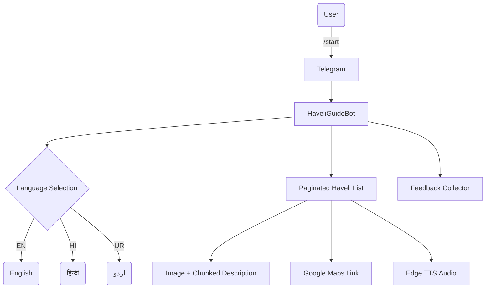

# 🏰 HaveliGuideBot – Interactive Heritage Explorer

&#x20;&#x20;

An intelligent Telegram bot that turns visits to Lucknow’s storied *havelis* into immersive, multimedia adventures. HaveliGuideBot delivers bite‑sized history, location maps and lifelike audio narration in the visitor’s language of choice – all from a single chat window.

---

## Table of Contents

1. [Problem Statement](#problem-statement)
2. [Solution Overview](#solution-overview)
3. [Key Features](#key-features)
4. [Technology Stack](#technology-stack)
5. [Installation & Setup](#installation--setup)
6. [Configuration](#configuration)
7. [Usage Guide](#usage-guide)
8. [Benefits for Tourists](#benefits-for-tourists)
9. [Contributing](#contributing)
10. [Roadmap](#roadmap)
11. [License](#license)
12. [Contact](#contact)
13. [Repository Structure](#repository-structure)
14. [Live Demo & One‑Click Deploy](#live-demo--one-click-deploy)

---

## 🌟 Problem Statement

> **How might we equip tourists exploring historic havelis in cities like Lucknow with engaging, reliable heritage narratives—without relying on physical signboards that are often missing, damaged or out‑of‑date?**

## 🚀 Solution Overview

HaveliGuideBot bridges this gap by offering:

- **Instant, curated content** drawn from a structured JSON data set
- **Multilingual delivery** (🇬🇧 English, 🇮🇳 हिन्दी, 🇵🇰 اردو) with automatic language detection & switching
- **Natural‑sounding audio** tours using Microsoft Edge TTS
- **Inline Google Maps links** to each haveli’s exact location
- **Conversational interface** with paginated browsing and 👍 / 👎 feedback buttons



---

## 🔑 Key Features

### 🤖 Interactive Chatbot Interface

- Button‑driven navigation with graceful fallback to typed commands
- Context‑aware replies and typing indicators for a polished UX

### 🈯 Multilingual Support

- Real‑time translation via **deep‑translator** (GoogleTranslator)
- Native scripts (Latin, Devanagari, Nastaʿlīq) for authentic presentation

### 🎧 High‑Fidelity Audio Guides

- Edge‑TTS neural voices produce natural speech in the selected language
- On‑demand generation with caching to keep response times snappy

### 🌐 Location Highlights

- Direct Google Maps links sent in a separate chat bubble for visibility
- Future‑ready hooks for GPS‑based proximity alerts

### 📚 Robust Content Pipeline

```python
async def deliver_content(haveli: dict, lang: str):
    await send_image(haveli["image"])
    for chunk in split_description(haveli["description"]):
        await send_text(chunk)
    await send_location(haveli["location_link"])
    await send_audio(tts_engine(chunk, lang))
```

---

## ⚙️ Technology Stack

| Layer             | Technology                | Purpose                                 |
| ----------------- | ------------------------- | --------------------------------------- |
| **Runtime**       | Python 3.10 + Asyncio     | Core bot logic & non‑blocking I/O       |
| **Bot Framework** | `python‑telegram‑bot` v21 | Telegram API & conversation management  |
| **Translation**   | `deep‑translator`         | Real‑time multilingual text translation |
| **TTS**           | `edge‑tts`                | Neural text‑to‑speech generation        |
| **Data Store**    | JSON (`Havelis.json`)     | Structured haveli metadata & assets     |
| **Deployment**    | Replit / Railway / Docker | Cloud‑agnostic hosting                  |

Advanced niceties: Async chunking, Markdown V2 safe rendering, neural voice selection & per‑user state persistence.

---

## 🛠️ Installation & Setup

\### Prerequisites

- Python **3.8+**
- A Telegram bot token from [@BotFather](https://t.me/BotFather)
- *(Optional)* Google Translate API key for higher request quotas

\### Quick Start

```bash
# Clone the repository
$ git clone https://github.com/yourusername/HaveliGuideBot.git
$ cd HaveliGuideBot

# Install dependencies
$ pip install -r requirements.txt

# Configure secrets (Unix / macOS / Linux)
$ echo "BOT_TOKEN=123456:ABCDEF..." > .env

# Run the bot
$ python bot.py
```

> **Tip:** Prefer `python -m bot` when packaging the project as a module.

---

## 🔧 Configuration

1. **Haveli data** — edit `Havelis.json`:

```json
{
  "Havelis": [
    {
      "name": "Bara Imambara",
      "description": "Historic monument in Lucknow...",
      "image": "https://example.com/bara_imambara.jpg",
      "location": "Lucknow, Uttar Pradesh",
      "location_link": "https://maps.app.goo.gl/example"
    }
  ]
}
```

2. **Language definitions** — extend `LANGUAGES` in `config.py`:

```python
LANGUAGES = {
    "en": {"name": "English", "keywords": ["english", "en"]},
    "hi": {"name": "हिन्दी",  "keywords": ["hindi", "hi", "हिंदी"]},
    "ur": {"name": "اردو",   "keywords": ["urdu", "ur", "اردو"]}
}
```

---

## 💡 Usage Guide

| Command  | Description                  |
| -------- | ---------------------------- |
| `/start` | Kick‑off the onboarding flow |
| `hindi`  | Switch UI to Hindi           |
| `next`   | Next page in haveli list     |
| `prev`   | Previous page                |

**User Journey**

1. Launch bot → choose language.
2. Browse paginated list of havelis.
3. Select a haveli → receive image, chunked description, maps link & audio.
4. Drop a 👍 or 👎 to help us improve.

---

## 🌈 Benefits for Tourists

| Benefit             | Impact                                                       |
| ------------------- | ------------------------------------------------------------ |
| **Deep Learning**   | Rich stories & cultural context beyond a simple plaque.      |
| **Accessibility**   | Works 24 × 7 on any smartphone, even with limited bandwidth. |
| **Conservation**    | Reduces the need for intrusive physical signage.             |
| **Personalization** | Language‑adaptive content & self‑paced exploration.          |

---

## 🤝 Contributing

We happily welcome issues, feature ideas and pull requests!

1. **Fork** the repo.
2. Create a feature branch: `git checkout -b feat/amazing`.
3. Commit & push.
4. Open a **pull request** detailing your changes.

Please follow the *Conventional Commits* spec and ensure the pre‑commit hooks pass.

---

## 🛣️ Roadmap

-

---

## 📜 License

Created by ***Shivang Agrawal***
Created on 21/06/2025

---

## 📞 Contact

| Role          | Name / Handle      | Reach Out                                                  |
| ------------- | ------------------ | ---------------------------------------------------------- |
| Project Lead  | **Your Name**      | `your.email@example.com` • @yourusername                   |
| Telegram Live | **HaveliGuideBot** | [https://t.me/HaveliGuideBot](https://t.me/HaveliGuideBot) |

---

## 🗂️ Repository Structure

```
HaveliGuideBot/
├── bot.py                 # Async entry point
├── Havelis.json           # Heritage dataset
├── requirements.txt       # Python deps
├── config.py              # App settings & constants
├── .env.example           # Environment template
├── LICENSE
├── README.md              # You are here ⭐
└── assets/                # Screenshots / media
    ├── lang_select.png
    ├── haveli_gallery.png
    └── haveli_detail.png
```

---

## 🚀 Live Demo & One‑Click Deploy

Experience HaveliGuideBot on Telegram: [**@HaveliGuideBot**](https://t.me/HaveliGuideBot)


